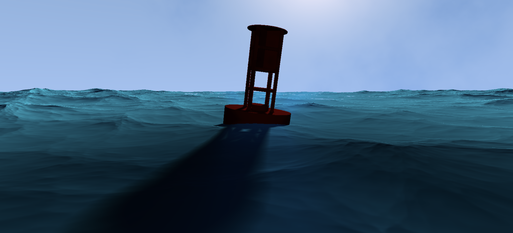
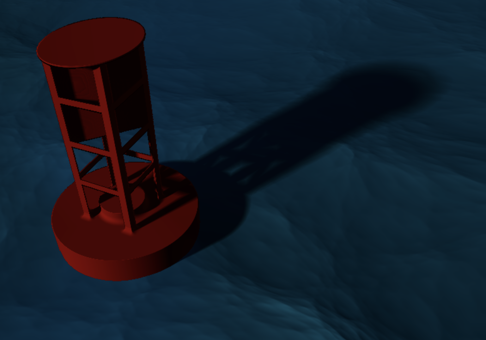

# Buoy at Sea

A project by Nicholas Keenan. (PennKey: nkeenan)
Demo Link: https://nkeenan38.github.io/hw03-environment-setpiece

*Note: It runs very slowly so you may need a decent machine to actually view it. Probably won't work in full screen.*

### The Water

The water is simply an SDF box with an additional offset. This offset is some fractal brownian motion that is animated with time. You'll notice that the water increases in intensity over time.

The reflectivity of the water is increased at glancing angles. Similarly, it is increased at angles that receive more direct sunlight.

### The Buoy

The buoy is made entirely from signed distance functions. A rounded cylinder forms the base. Planes reflected across the x and z axes construct the four angle irons. Another set of planes form the cross section near the top of the structure. Finally, another cylinder tops of the structure.

The buoy bobs up and down with the height of the water at its center. Similarly, it rocks in the x and z directions depending on the height of the water at its edges compared to the center.

### The Sky

The clouds in the sky are created with fractal brownian motion. The sun is created by adding light to the sky's color depending on the viewing angle to the sun.

